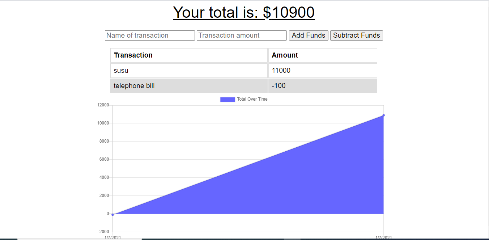

# Pwahomework
Budget-ttracker

[link to heroku](https://aqueous-scrubland-79272.herokuapp.com/?id=5ff20e101e9e2900171a52cb)

  ## Table of Contents
  * [Description](#Description)
  * [Usage](#Usage)
  * [Installation](#Installation)
  * [License](#License)
  * [Contributors](#contributers)
  * [Test](#Test)
  * [Questions](#Questions)

  ## Description
 Add functionality to our existing Budget Tracker application to allow for offline access and functionality.
  

  ## Installation Instuctions
  Offline Functionality:

Enter deposits offline

Enter expenses offline

When brought back online:

Offline entries should be added to tracker.

  ## Usage Information
 AS AN avid traveller
I WANT to be able to track my withdrawals and deposits with or without a data/internet connection
SO THAT my account balance is accurate when I am traveling
  ## License
  None

  ## Contributers
  one

  ## Test
  test

  ## Question
  Contact me:

  Github:[AdrianStorr](https://github.com/AdrianStorr)
  
  Email :[abd,gmail.com](https://github.com/AdrianStorr)
